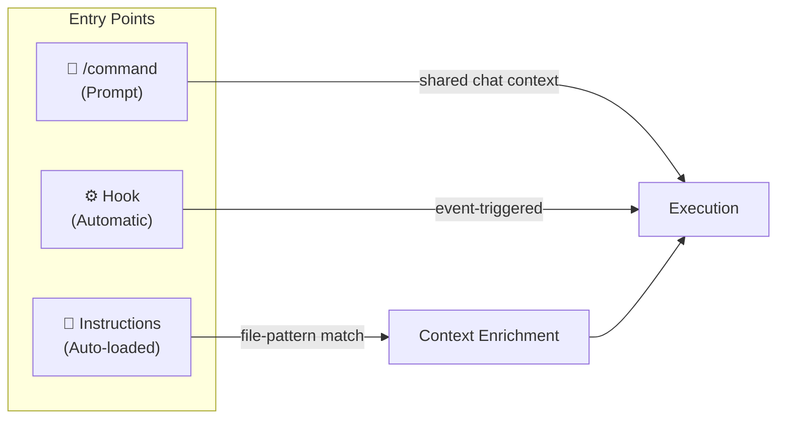

# Copilot Workflow Automation Config

This repo contains GitHub Copilot workflow automation for Microsoft Learn platform development across multiple repositories.

## Architecture

```
.github/
├── copilot-instructions.md          # Auto-loaded every session. Exact filename required.
├── agents/                          # Agent personas referenced by prompts via agent: frontmatter
│   ├── mslearn-implementation.agent.md
│   ├── mslearn-planning.agent.md
│   ├── mslearn-research.agent.md
│   └── mslearn-code-review.agent.md
├── prompts/                         # Workflows invoked via /command
│   ├── mslearn-small-feature.prompt.md
│   ├── mslearn-large-feature.prompt.md
│   ├── mslearn-parity-feature.prompt.md
│   ├── mslearn-create-plan.prompt.md
│   ├── mslearn-implement-plan.prompt.md
│   ├── mslearn-research-codebase.prompt.md
│   ├── mslearn-ship-it.prompt.md
│   ├── mslearn-review-it.prompt.md
│   ├── mslearn-update-plan.prompt.md
│   ├── mslearn-resume-handoff.prompt.md
│   ├── mslearn-create-handoff.prompt.md
│   ├── mslearn-create-ado-workitems.prompt.md
│   ├── mslearn-assign-swe.prompt.md
│   ├── mslearn-explain-pr.prompt.md
│   ├── mslearn-pre-commit.prompt.md
│   ├── mslearn-prune-worktree.prompt.md
│   ├── mslearn-create-worktree.prompt.md
│   └── mslearn-session-learnings.prompt.md
├── skills/                          # Single-purpose action packages
│   ├── assign-swe/SKILL.md
│   ├── create-ado-workitems/SKILL.md
│   ├── create-handoff/SKILL.md
│   ├── create-worktree/SKILL.md
│   ├── explain-pr/SKILL.md
│   ├── pre-commit/SKILL.md
│   ├── prune-worktree/SKILL.md
│   └── session-learnings/SKILL.md
├── hooks/                           # Agent lifecycle hooks (preToolUse, sessionEnd, etc.)
│   ├── copilot-agent-hooks.json     # Hook config referencing scripts
│   └── scripts/                     # Shell scripts executed by hooks
│       ├── safety-guard.sh/ps1      # Block dangerous commands and paths
│       ├── pre-commit-gate.sh/ps1   # Run repo-specific quality checks before commit
│       └── session-end-learnings.sh/ps1  # Log session end for learnings extraction
├── config/
│   └── workflow-config.json         # Central settings with ${ENV_VAR} substitution
└── instructions/
    └── *.instructions.md            # Auto-loaded by applyTo file pattern
.vscode/
├── settings.json                    # Copilot instruction hooks (commit messages, review, test generation, PR description)
└── mcp.json                         # Model Context Protocol configuration
agent-artifacts/                     # Output directory (not committed)
├── research/
├── plans/
├── handoffs/
├── reviews/
└── learnings/
```

## File Types & Loading Behavior

| File Type | Location | Loaded When | Named By | Trigger |
|-----------|----------|-------------|----------|---------|
| `copilot-instructions.md` | `.github/` | **Auto** — every session | Exact filename | Always active |
| `{name}.agent.md` | `agents/` | **Invoked** — `@name` | Frontmatter `name` | User mentions `@name` |
| `{name}.prompt.md` | `prompts/` | **Invoked** — `/name` | **Filename** stem | User runs `/name` |
| `{topic}.instructions.md` | `instructions/` | **Auto** — matching files in context | Filename + frontmatter `applyTo` | Files matching glob are open |
| `SKILL.md` | `skills/{name}/` | **On-demand** — referenced by prompts/agents | Frontmatter `name` | Prompt or agent reads the file |
| `*.json` (hooks) | `hooks/` | **Auto** — agent lifecycle events | Free-form filename | `preToolUse`, `postToolUse`, `sessionStart`, etc. |
| `workflow-config.json` | `config/` | **On-demand** — read by prompts/skills | Exact filename | Prompts/skills reference it |

### Naming Rules

- **Exact names**: `copilot-instructions.md`, `SKILL.md`, `workflow-config.json`
- **Convention names**: `*.agent.md`, `*.prompt.md`, `*.instructions.md` — suffix determines type, stem is free-form
- **Use hyphens** (`kebab-case`) in all filenames — no underscores
- **Frontmatter-named**: Agents and Skills use frontmatter `name` as display/invocation identity
- **Filename-named**: Prompts use filename stem directly (e.g., `mslearn-ship-it.prompt.md` → `/mslearn-ship-it`)

## Design Philosophy

> *"The most successful implementations weren't using complex frameworks. Instead, they were building with simple, composable patterns."*
> — [Anthropic: Building Effective Agents](https://anthropic.com/research/building-effective-agents)

**Start simple. Add complexity only when it demonstrably improves outcomes.**

Anthropic distinguishes two architectural approaches:

- **Workflows** — LLMs orchestrated through predefined code paths. Predictable, consistent, lower cost.
- **Agents** — LLMs dynamically direct their own processes and tool usage. Flexible, autonomous, higher cost.

Most tasks should be workflows. Use agents only when the task is genuinely open-ended and steps cannot be predicted in advance.

### Workflow Patterns in This Repo

Our prompts implement several of Anthropic's documented workflow patterns:

| Pattern | Description | Examples |
|---------|-------------|----------|
| **Prompt chaining** | Sequential steps, each processing previous output | `/mslearn-ship-it` (stage → commit → push → PR) |
| **Routing** | Classify input, direct to specialized handler | `/mslearn-small-feature` vs `/mslearn-large-feature` |
| **Orchestrator-workers** | Central LLM breaks down tasks, delegates, synthesizes | `/mslearn-research-codebase`, `/mslearn-create-plan` |
| **Evaluator-optimizer** | Generate + evaluate in a feedback loop | `/mslearn-review-it` |

## When to Use Each Artifact Type

### Prompts (`/command`) — Workflows with predefined steps

**Use prompts when:**

- The task has a **known sequence of steps** that can be defined in advance
- The workflow needs access to the **user's chat context**
- The process benefits from **interactive human feedback** during execution
- You're **orchestrating** other tools and skills

**Current prompts fall into two categories:**

| Category | Prompts | Description |
|----------|---------|------------|
| **Orchestration workflows** | `/mslearn-small-feature`, `/mslearn-large-feature`, `/mslearn-parity-feature`, `/mslearn-create-plan`, `/mslearn-implement-plan`, `/mslearn-research-codebase`, `/mslearn-ship-it`, `/mslearn-review-it`, `/mslearn-update-plan`, `/mslearn-resume-handoff` | Multi-step interactive workflows with real orchestration logic |
| **Skill entry points** | `/mslearn-pre-commit`, `/mslearn-create-handoff`, `/mslearn-assign-swe`, `/mslearn-create-ado-workitems`, `/mslearn-explain-pr`, `/mslearn-prune-worktree`, `/mslearn-create-worktree`, `/mslearn-session-learnings` | Thin wrappers providing `/command` discoverability + agent persona for a skill |

> **Note on skill entry points**: These prompts exist for discoverability (users type `/command`) and to set the `agent:` persona. The actual logic lives in the corresponding skill. This is acceptable when the prompt adds routing value; avoid it when you could just reference the skill directly from another prompt.

### Skills (`.github/skills/`) — Reusable, self-contained capabilities

Use skills when:

- The action is **single-purpose** with clear inputs and outputs
- It needs **embedded resources** (templates, scripts, reference docs)
- It's **reused by multiple prompts** or agents
- It benefits from **progressive disclosure** (load context only when activated)

**Skill design rules** (from [Octane best practices](https://github.com/azure-core/octane/blob/main/docs/best-practices.md)):

- Keep `SKILL.md` **under 500 lines** — put detailed docs in `references/`
- **Progressive loading**: metadata (~100 tokens) → instructions (<5000 tokens) → resources (on-demand)
- Include **what** the skill does AND **when** to use it in the description
- Keep file references **one level deep** from SKILL.md

| Skill | Purpose |
|-------|---------|
| `assign-swe` | Assign GitHub SWE to work item |
| `create-ado-workitems` | Create ADO work items from plan |
| `create-handoff` | Create session handoff document |
| `create-worktree` | Create worktree with auth and npm install |
| `explain-pr` | Generate PR explanation document |
| `pre-commit` | Run quality gate checks |
| `prune-worktree` | Remove worktrees and workspace files |
| `session-learnings` | Extract session learnings and self-heal automation files |

### Agents (`@name`) — Autonomous, open-ended exploration

Use agents when:

- The task requires **dynamic decision-making** (steps cannot be predicted in advance)
- The LLM needs to **operate for many turns** independently
- The task needs **isolated context** (separate from chat history)
- **Higher cost and latency** are acceptable for better task performance
- There's sufficient **trust in the LLM's decision-making** for the domain

> **Current state**: Four persona agents exist in this repo — `mslearn-implementation`, `mslearn-planning`, `mslearn-research`, and `mslearn-code-review`. These serve as **shared persona/tool configurations** referenced by prompts via `agent:` frontmatter, not as standalone autonomous agents. They define which tools a prompt has access to and set behavioral instructions for the role.
>
> Three sub-agents (codebase-locator, codebase-analyzer, codebase-pattern-finder) were intentionally removed as they created deep agent hierarchies. Their functionality is handled directly by the main agents using search and read tools.

Create dedicated `.agent.md` files when:
- Multiple prompts share the same **tool configuration** and **behavioral instructions**
- The persona definition provides genuine value as a reusable configuration
- The agent definition keeps SKILL.md and prompt files focused on their specific workflows

**When NOT to create an agent:**
- The task has a predictable sequence of steps → use a **prompt**
- The task is a single focused action → use a **skill**
- You're tempted to create a sub-agent hierarchy → use **direct tool calls** within the existing agent (Anthropic's orchestrator-workers pattern with parallelization)

### Instructions (`.instructions.md`) — Passive context enrichment

Use instructions when:

- Rules should apply **automatically** whenever specific files are open
- No user invocation is needed — they **augment** the LLM's knowledge
- Context is **file-pattern specific** (e.g., TypeScript standards for `*.ts` files)

### Hooks — Automatic guardrails and gates

Use hooks when:

- Actions must run **without user invocation**
- You need to **enforce safety constraints** (block destructive commands)
- You need to **gate actions** (quality checks before commit)
- You need to **capture telemetry** (session end logging)

### Anti-Patterns to Avoid

| Anti-Pattern | Why It's Bad | Do This Instead |
|-------------|-------------|-----------------|
| **Premature agent use** | Agents add latency and cost; autonomous decision-making compounds errors | Use a prompt with predefined steps when the workflow is known |
| **Monolithic prompts** | Templates, scripts, and reference docs bloat the prompt and waste context | Extract reusable components to skills with progressive disclosure |
| **Deep agent hierarchies** | Sub-agents add abstraction layers that obscure prompts and responses | Use parallelization within a single prompt (orchestrator-workers pattern) |
| **Over-abstraction** | Extra layers make it harder to debug; incorrect assumptions about what's under the hood cause errors | Keep the architecture as simple as possible; build with basic components |

## Copilot Hooks

### Instruction Hooks (VS Code)

Configured in `.vscode/settings.json`, applied automatically when Copilot generates content:

| Hook | When Applied |
|------|-------------|
| Commit message generation | Copilot generates a commit message |
| Code review instructions | Copilot reviews selected code |
| Test generation instructions | Copilot generates tests |
| PR description generation | Copilot generates a PR title or description |

### Agent Lifecycle Hooks (Coding Agent & CLI)

Configured in `.github/hooks/copilot-agent-hooks.json`, executed as shell scripts during agent sessions:

| Hook | Script | Purpose |
|------|--------|---------|
| `preToolUse` | `safety-guard.sh/ps1` | Blocks destructive commands (`rm -rf /`, `DROP TABLE`), force pushes to main/develop, direct pushes to protected branches, edits to CI/CD configs and lock files |
| `preToolUse` | `pre-commit-gate.sh/ps1` | Intercepts `git commit` and runs the repo-specific `preCommitCommand` from `workflow-config.json` before allowing |

## Configuration (`.env` + `workflow-config.json`)

- **`.env`**: Personal settings — alias, email, ADO assignee, area path, org, project (not committed)
- **`workflow-config.json`**: Shared config with `${ENV_VAR}` placeholders resolved from `.env`
- **Setup**: `cp .env.example .env` then edit with your values

### Token Substitution Variables

| Token | Source | Example Value |
|-------|--------|---------------|
| `${USER_ALIAS}` | `.env` | `jumunn` |
| `${USER_EMAIL}` | `.env` | `jumunn@microsoft.com` |
| `${ADO_AREA_PATH}` | `.env` | `Engineering\POD\YourTeam` |
| `${ADO_ORGANIZATION}` | `.env` | `https://dev.azure.com/ceapex` |
| `${ADO_PROJECT}` | `.env` | `Engineering` |
| `{id}` | Runtime (work item) | `123456` |
| `{repo}` | Runtime (git) | `docs-ui` |
| `{PrNumber}` | Runtime (PR creation) | `4521` |
| `{date}` | Runtime | `2026-02-04` |
| `{ticketId}` | User input | `AB#123456` |
| `{description}` | User input | `rating-system` |

## Tool Guidance — Common Pitfalls

| Scenario | What to do |
|----------|------------|
| GitHub URL returns 404 | The repo may be private. Prompt the user: "This returned a 404 — is this a private repo? If so, I don't have a GitHub PR MCP tool for private repos. Could you check the PR directly and share the details?" |
| Need to search emails | Use `mcp_workiq_ask_work_iq` (see ADO work item instructions for details) |
| ADO work item iteration fails (TF401347) | Omit `iterationPath` and let ADO default it |

## Execution Architecture

Every interaction enters through one of four entry points, each with different context and autonomy levels.

### Entry Points



### Prompt Architecture

Prompts declare an `agent:` persona in frontmatter, which loads the corresponding `.agent.md` file for tool access and behavioral instructions. Some prompts contain full orchestration logic; others delegate to skills.

```mermaid
graph TB
    subgraph "Agent Personas (shared tool + instruction configs)"
        A_IM["mslearn-implementation<br/>tools: read, edit, search,<br/>execute, todo"]
        A_PL["mslearn-planning<br/>tools: read, edit, search,<br/>execute, todo"]
        A_RE["mslearn-research<br/>tools: read, edit, search,<br/>execute, web"]
        A_CR["mslearn-code-review<br/>tools: read, edit,<br/>search, execute"]
    end

    subgraph "Orchestration Prompts (contain workflow logic)"
        P_SF["/mslearn-small-feature"]
        P_LF["/mslearn-large-feature"]
        P_PF["/mslearn-parity-feature"]
        P_CP["/mslearn-create-plan"]
        P_IP["/mslearn-implement-plan"]
        P_RC["/mslearn-research-codebase"]
        P_SI["/mslearn-ship-it"]
        P_RI["/mslearn-review-it"]
        P_UP["/mslearn-update-plan"]
        P_RH["/mslearn-resume-handoff"]
    end

    P_SF & P_IP & P_SI & P_RH -->|"agent:"| A_IM
    P_LF & P_PF & P_CP & P_UP -->|"agent:"| A_PL
    P_RC -->|"agent:"| A_RE
    P_RI -->|"agent:"| A_CR

    subgraph "Skill Entry Points (thin wrappers for discoverability)"
        P_PC["/mslearn-pre-commit"]
        P_CH["/mslearn-create-handoff"]
        P_ADO["/mslearn-create-ado-workitems"]
        P_SWE["/mslearn-assign-swe"]
        P_EP["/mslearn-explain-pr"]
        P_PW["/mslearn-prune-worktree"]
        P_CW["/mslearn-create-worktree"]
        P_SL["/mslearn-session-learnings"]
    end

    subgraph "Skills (reusable capabilities)"
        SK_PC["pre-commit"]
        SK_CH["create-handoff"]
        SK_ADO["create-ado-workitems"]
        SK_SWE["assign-swe"]
        SK_EP["explain-pr"]
        SK_PW["prune-worktree"]
        SK_CW["create-worktree"]
        SK_SL["session-learnings"]
    end

    P_PC -->|"reads SKILL.md"| SK_PC
    P_CH -->|"reads SKILL.md"| SK_CH
    P_ADO -->|"reads SKILL.md"| SK_ADO
    P_SWE -->|"reads SKILL.md"| SK_SWE
    P_EP -->|"reads SKILL.md"| SK_EP
    P_PW -->|"reads SKILL.md"| SK_PW
    P_CW -->|"reads SKILL.md"| SK_CW
    P_SL -->|"reads SKILL.md"| SK_SL

    P_SI -.->|"calls before commit"| SK_PC
    P_CH -.->|"calls first"| SK_SL
```



### Hooks (Automatic Entry Points)

Two types of hooks fire automatically — no user invocation required.

**Instruction hooks** (VS Code `settings.json`) — influence generated content:

| Hook | Trigger Event | What It Does |
|------|---------------|--------------|
| Commit message | Copilot generates commit msg | Enforces conventional commits format with `type(scope): description` |
| Code review | Copilot reviews selection | Checks MS Learn patterns: TypeScript types, Fluent UI tokens, SSR compat, a11y |
| Test generation | Copilot generates tests | Enforces Jest + TypeScript patterns, SSR paths, Griffel mocking |
| PR description | Copilot generates PR title/description | Conventional commit title format, structured sections (Overview, Links, Testing, Notes) |

**Agent lifecycle hooks** (`.github/hooks/*.json`) — execute shell scripts during agent sessions:

| Hook | Script | What It Does |
|------|--------|--------------|
| `preToolUse` | `safety-guard` | Blocks destructive commands, force pushes to protected branches, edits to CI/CD and lock files |
| `preToolUse` | `pre-commit-gate` | Runs repo-specific quality checks from `workflow-config.json` before `git commit` |
| `sessionEnd` | `session-end-learnings` | Logs session metadata and writes marker for learnings extraction via `/mslearn-session-learnings` |

### Instructions (Auto-Loaded Context)

Instructions enrich context automatically when matching files are open. They don't execute — they inform.

| Instruction | `applyTo` Pattern | Purpose |
|-------------|-------------------|---------|
| `azure-devops-workitems` | *(always loaded)* | ADO CLI commands and configuration |

### Typical Workflow Sequences

**Feature development (large):**
```
/mslearn-research-codebase → /mslearn-create-plan → /mslearn-create-ado-workitems → /mslearn-implement-plan → /mslearn-pre-commit → /mslearn-ship-it
```

**Feature development (small):**
```
/mslearn-small-feature → /mslearn-pre-commit → /mslearn-ship-it
```

**Code review:**
```
/mslearn-review-it → /mslearn-explain-pr
```

**Session management:**
```
/mslearn-create-handoff → (new session) → /mslearn-resume-handoff
```

**Session learnings (self-healing):**
```
(end of session) → /mslearn-session-learnings → approve patches → improved prompts/skills
```

**Plan maintenance:**
```
/mslearn-update-plan → /mslearn-assign-swe
```

## Adding New Components

**New Prompt**: Create `.github/prompts/{name}.prompt.md` with frontmatter: `description`, `agent`, `model`
- Use for **multi-step interactive workflows** with predefined steps (Anthropic's workflow patterns)
- If the prompt just delegates to a skill, consider whether the `/command` discoverability is worth the extra abstraction layer

**New Skill**: Create `.github/skills/{name}/SKILL.md` with frontmatter: `name`, `description`. Add optional `references/` for templates.
- Use for **single-purpose, reusable actions** with clear inputs/outputs
- Keep SKILL.md **under 500 lines** — put detailed docs in `references/`
- Include **what** the skill does AND **when** to use it in the description
- Follow progressive disclosure: metadata → instructions → resources (on-demand)

**New Agent**: Create `.github/agents/{name}.agent.md` with frontmatter: `name`, `description`, `tools`
- Use **only** when the task is genuinely **open-ended** and steps cannot be predicted in advance
- Before creating an agent, ask: "Can this be a prompt with predefined steps?" — if yes, use a prompt
- Agents add **latency and cost**; autonomous decision-making can **compound errors**
- Test extensively before deploying — agents need guardrails (hooks) and human checkpoints

**New Instruction**: Create `.github/instructions/{name}.instructions.md` with frontmatter: `applyTo` glob pattern
- Use for **passive context enrichment** that should apply whenever matching files are open

**New Instruction Hook**: Add to `.vscode/settings.json` under `github.copilot.chat.*`

**New Agent Lifecycle Hook**: Add to `.github/hooks/copilot-agent-hooks.json` with a script in `.github/hooks/scripts/`. Provide both `.sh` and `.ps1` variants. Available events: `sessionStart`, `sessionEnd`, `userPromptSubmitted`, `preToolUse`, `postToolUse`, `errorOccurred`

**New Repo Config**: Add to `repositories` in `workflow-config.json` with `defaultBranch`, `preCommitCommand`, `previewUrlPattern`

## Artifacts Convention

Filename patterns (from config):
- Research: `{date}-{ticketId}-{description}.md`
- Plans: `{date}-{ticketId}-{description}-plan.md`
- Handoffs: `{date}_{time}_{ticketId}_{description}.md`
- Learnings: `{date}-{description}-learnings.md`

Include Mermaid diagrams in research artifacts for quick system understanding.
