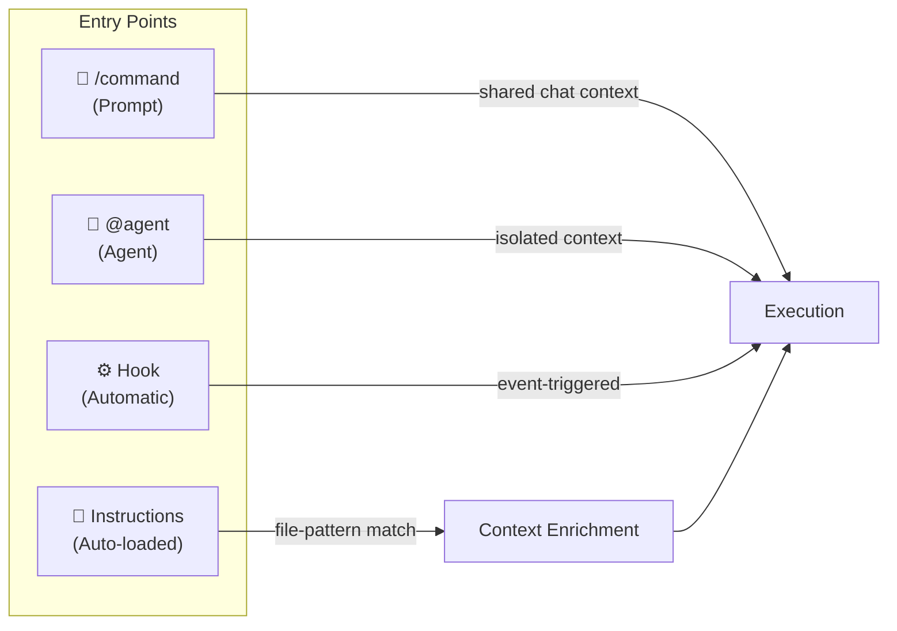
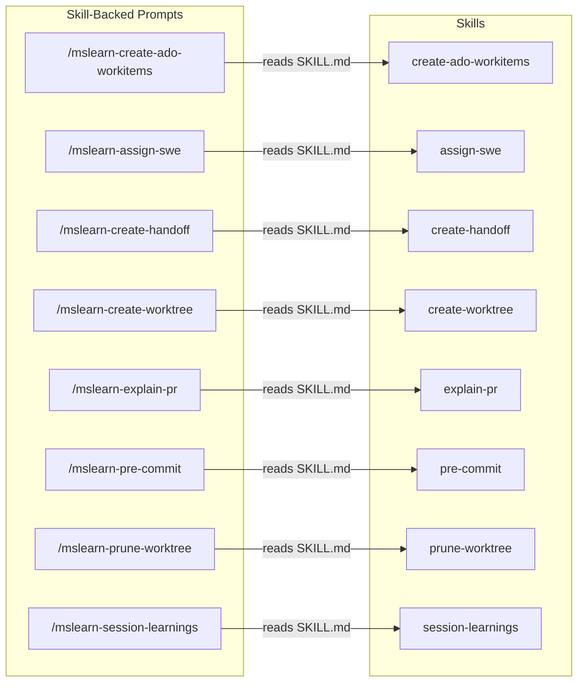

# Copilot Workflow Automation Config

This repo contains GitHub Copilot workflow automation for Microsoft Learn platform development across multiple repositories.

## Architecture

```
.github/
├── copilot-instructions.md          # Auto-loaded every session. Exact filename required.
├── agents/                          # Autonomous agents invoked via @name
│   ├── mslearn-research.agent.md
│   ├── mslearn-planning.agent.md
│   ├── mslearn-implementation.agent.md
│   ├── mslearn-code-review.agent.md
│   ├── mslearn-codebase-locator.agent.md
│   ├── mslearn-codebase-analyzer.agent.md
│   └── mslearn-codebase-pattern-finder.agent.md
├── prompts/                         # Workflows invoked via /command
│   ├── mslearn-small-feature.prompt.md
│   ├── mslearn-large-feature.prompt.md
│   ├── mslearn-parity-feature.prompt.md
│   ├── mslearn-create-plan.prompt.md
│   ├── mslearn-implement-plan.prompt.md
│   ├── mslearn-research-codebase.prompt.md
│   ├── mslearn-ship-it.prompt.md
│   ├── mslearn-review-it.prompt.md
│   ├── mslearn-update-plan.prompt.md
│   ├── mslearn-resume-handoff.prompt.md
│   ├── mslearn-create-handoff.prompt.md
│   ├── mslearn-create-ado-workitems.prompt.md
│   ├── mslearn-assign-swe.prompt.md
│   ├── mslearn-explain-pr.prompt.md
│   ├── mslearn-pre-commit.prompt.md
│   ├── mslearn-prune-worktree.prompt.md
│   ├── mslearn-create-worktree.prompt.md
│   └── mslearn-session-learnings.prompt.md
├── skills/                          # Single-purpose action packages
│   ├── assign-swe/SKILL.md
│   ├── create-ado-workitems/SKILL.md
│   ├── create-handoff/SKILL.md
│   ├── create-worktree/SKILL.md
│   ├── explain-pr/SKILL.md
│   ├── pre-commit/SKILL.md
│   ├── prune-worktree/SKILL.md
│   └── session-learnings/SKILL.md
├── hooks/                           # Agent lifecycle hooks (preToolUse, sessionEnd, etc.)
│   ├── copilot-agent-hooks.json     # Hook config referencing scripts
│   └── scripts/                     # Shell scripts executed by hooks
│       ├── safety-guard.sh/ps1      # Block dangerous commands and paths
│       ├── pre-commit-gate.sh/ps1   # Run repo-specific quality checks before commit
│       └── session-end-learnings.sh/ps1  # Log session end for learnings extraction
├── config/
│   └── workflow-config.json         # Central settings with ${ENV_VAR} substitution
└── instructions/
    └── *.instructions.md            # Auto-loaded by applyTo file pattern
.vscode/
└── settings.json                    # Copilot instruction hooks (commit messages, review, test generation, PR description)
agent-artifacts/                     # Output directory (not committed)
├── research/
├── plans/
├── handoffs/
├── reviews/
└── learnings/
```

## File Types & Loading Behavior

| File Type | Location | Loaded When | Named By | Trigger |
|-----------|----------|-------------|----------|---------|
| `copilot-instructions.md` | `.github/` | **Auto** — every session | Exact filename | Always active |
| `{name}.agent.md` | `agents/` | **Invoked** — `@name` | Frontmatter `name` | User mentions `@name` |
| `{name}.prompt.md` | `prompts/` | **Invoked** — `/name` | **Filename** stem | User runs `/name` |
| `{topic}.instructions.md` | `instructions/` | **Auto** — matching files in context | Filename + frontmatter `applyTo` | Files matching glob are open |
| `SKILL.md` | `skills/{name}/` | **On-demand** — referenced by prompts/agents | Frontmatter `name` | Prompt or agent reads the file |
| `*.json` (hooks) | `hooks/` | **Auto** — agent lifecycle events | Free-form filename | `preToolUse`, `postToolUse`, `sessionStart`, etc. |
| `workflow-config.json` | `config/` | **On-demand** — read by prompts/skills | Exact filename | Prompts/skills reference it |

### Naming Rules

- **Exact names**: `copilot-instructions.md`, `SKILL.md`, `workflow-config.json`
- **Convention names**: `*.agent.md`, `*.prompt.md`, `*.instructions.md` — suffix determines type, stem is free-form
- **Use hyphens** (`kebab-case`) in all filenames — no underscores
- **Frontmatter-named**: Agents and Skills use frontmatter `name` as display/invocation identity
- **Filename-named**: Prompts use filename stem directly (e.g., `mslearn-ship-it.prompt.md` → `/mslearn-ship-it`)

## Agents (`@mention`)

Agents run in **isolated context** for autonomous, multi-step work. They cannot see main chat history.

### Main Agents

| Agent | Purpose |
|-------|---------|
| `@mslearn-research` | Deep codebase research and documentation |
| `@mslearn-planning` | Create detailed implementation plans |
| `@mslearn-implementation` | Execute plans step by step |
| `@mslearn-code-review` | Review code for quality and patterns |

### Sub-Agents (invoked by main agents and prompts)

| Agent | Purpose |
|-------|---------|
| `@mslearn-codebase-locator` | Find WHERE files and components exist |
| `@mslearn-codebase-analyzer` | Analyze HOW specific code works |
| `@mslearn-codebase-pattern-finder` | Find examples of existing patterns |

### Agent Hierarchy

```
@mslearn-research ──┬── @mslearn-codebase-locator
                    ├── @mslearn-codebase-analyzer
                    └── @mslearn-codebase-pattern-finder

@mslearn-planning ──┬── @mslearn-codebase-locator
                    └── @mslearn-codebase-analyzer

@mslearn-implementation ── (uses plan artifacts directly)

@mslearn-code-review ── (standalone)
```

### Agent Frontmatter

```yaml
---
name: mslearn-{name}
description: {concise purpose}
tools:
  - read
  - search
  - execute
  - agent       # only if agent spawns sub-agents
---
```

## Workflows (`/command`)

Prompts run in **shared context** with user chat. They orchestrate agents and skills for multi-step interactive processes.

| Command | Purpose |
|---------|---------|
| `/mslearn-small-feature` | Quick implementation (< 2 hours) |
| `/mslearn-large-feature` | Multi-repo, multi-phase features |
| `/mslearn-parity-feature` | Port feature between repos |
| `/mslearn-create-plan` | Create implementation plans |
| `/mslearn-implement-plan` | Execute plan phases |
| `/mslearn-research-codebase` | Document codebase as-is |
| `/mslearn-ship-it` | Commit, push, create PR |
| `/mslearn-review-it` | Review PR branch |
| `/mslearn-update-plan` | Sync plan with codebase |
| `/mslearn-resume-handoff` | Resume from handoff document |
| `/mslearn-create-handoff` | Create session handoff document |
| `/mslearn-create-ado-workitems` | Create ADO work items from plan |
| `/mslearn-assign-swe` | Assign GitHub SWE to work item |
| `/mslearn-explain-pr` | Generate PR explanation document |
| `/mslearn-pre-commit` | Pre-commit quality gate |
| `/mslearn-prune-worktree` | Remove worktrees and clean up resources |
| `/mslearn-create-worktree` | Create worktree with auth, deps, and agent symlinks |
| `/mslearn-session-learnings` | Extract learnings and self-heal agents/prompts/skills |

## Skills (`.github/skills/`)

Self-contained single-purpose action packages. Each has a `SKILL.md` (exact name) with optional `references/` directory for templates.

| Skill | Purpose |
|-------|---------|
| `assign-swe` | Assign GitHub SWE to work item |
| `create-ado-workitems` | Create ADO work items from plan |
| `create-handoff` | Create session handoff document |
| `create-worktree` | Create worktree with auth and npm install |
| `explain-pr` | Generate PR explanation document |
| `pre-commit` | Run quality gate checks |
| `prune-worktree` | Remove worktrees and workspace files |
| `session-learnings` | Extract session learnings and self-heal automation files |

## When to Use Agents vs Prompts vs Skills

| Use **Agent** when: | Use **Prompt** when: | Use **Skill** when: |
|---------------------|----------------------|---------------------|
| Task requires deep autonomous research | Multi-step interactive workflow | Single focused action |
| Need isolated context from chat history | Need to see user's chat history | Template-driven output |
| Spawning parallel sub-agents | Orchestrating agents and skills | Running quality gates |
| Producing research/review artifacts | Complex feature implementation | Creating/assigning artifacts |

## Copilot Hooks

### Instruction Hooks (VS Code)

Configured in `.vscode/settings.json`, applied automatically when Copilot generates content:

| Hook | When Applied |
|------|-------------|
| Commit message generation | Copilot generates a commit message |
| Code review instructions | Copilot reviews selected code |
| Test generation instructions | Copilot generates tests |
| PR description generation | Copilot generates a PR title or description |

### Agent Lifecycle Hooks (Coding Agent & CLI)

Configured in `.github/hooks/copilot-agent-hooks.json`, executed as shell scripts during agent sessions:

| Hook | Script | Purpose |
|------|--------|---------|
| `preToolUse` | `safety-guard.sh/ps1` | Blocks destructive commands (`rm -rf /`, `DROP TABLE`), force pushes to main/develop, direct pushes to protected branches, edits to CI/CD configs and lock files |
| `preToolUse` | `pre-commit-gate.sh/ps1` | Intercepts `git commit` and runs the repo-specific `preCommitCommand` from `workflow-config.json` before allowing |

## Configuration (`.env` + `workflow-config.json`)

- **`.env`**: Personal settings — alias, email, ADO assignee, area path, org, project (not committed)
- **`workflow-config.json`**: Shared config with `${ENV_VAR}` placeholders resolved from `.env`
- **Setup**: `cp .env.example .env` then edit with your values

### Token Substitution Variables

| Token | Source | Example Value |
|-------|--------|---------------|
| `${USER_ALIAS}` | `.env` | `jumunn` |
| `${USER_EMAIL}` | `.env` | `jumunn@microsoft.com` |
| `${ADO_AREA_PATH}` | `.env` | `Engineering\POD\YourTeam` |
| `${ADO_ORGANIZATION}` | `.env` | `https://dev.azure.com/ceapex` |
| `${ADO_PROJECT}` | `.env` | `Engineering` |
| `{id}` | Runtime (work item) | `123456` |
| `{repo}` | Runtime (git) | `docs-ui` |
| `{PrNumber}` | Runtime (PR creation) | `4521` |
| `{date}` | Runtime | `2026-02-04` |
| `{ticketId}` | User input | `AB#123456` |
| `{description}` | User input | `rating-system` |

## Execution Architecture

Every interaction enters through one of four entry points, each with different context and autonomy levels.

### Entry Points



### Prompt → Agent → Sub-Agent Wiring

Each prompt declares an `agent:` in its frontmatter, which determines the agent persona used for execution. Agents may spawn sub-agents for parallel research.

```mermaid
graph TB
    subgraph "Prompts (user runs /command)"
        subgraph "Planning Agent Prompts"
            P_CP["/mslearn-create-plan"]
            P_UP["/mslearn-update-plan"]
            P_LF["/mslearn-large-feature"]
            P_PF["/mslearn-parity-feature"]
            P_ADO["/mslearn-create-ado-workitems"]
            P_SWE["/mslearn-assign-swe"]
            P_CH["/mslearn-create-handoff"]
        end
        subgraph "Implementation Agent Prompts"
            P_IP["/mslearn-implement-plan"]
            P_SF["/mslearn-small-feature"]
            P_SI["/mslearn-ship-it"]
            P_RH["/mslearn-resume-handoff"]
            P_PC["/mslearn-pre-commit"]
            P_PW["/mslearn-prune-worktree"]
            P_CW["/mslearn-create-worktree"]
            P_SL["/mslearn-session-learnings"]
        end
        subgraph "Research Agent Prompts"
            P_RC["/mslearn-research-codebase"]
            P_EP["/mslearn-explain-pr"]
        end
        subgraph "Code Review Agent Prompts"
            P_RI["/mslearn-review-it"]
        end
    end

    subgraph "Main Agents"
        A_PL["@mslearn-planning<br/>tools: read, edit, search,<br/>execute, agent, todo"]
        A_IM["@mslearn-implementation<br/>tools: read, edit, search,<br/>execute, todo"]
        A_RE["@mslearn-research<br/>tools: read, edit, search,<br/>execute, agent, web"]
        A_CR["@mslearn-code-review<br/>tools: read, edit,<br/>search, execute"]
    end

    subgraph "Sub-Agents"
        SA_L["@mslearn-codebase-locator<br/>tools: read, search"]
        SA_A["@mslearn-codebase-analyzer<br/>tools: read, search"]
        SA_P["@mslearn-codebase-pattern-finder<br/>tools: read, search"]
    end

    P_CP & P_UP & P_LF & P_PF & P_ADO & P_SWE & P_CH --> A_PL
    P_IP & P_SF & P_SI & P_RH & P_PC & P_PW & P_CW & P_SL --> A_IM
    P_RC & P_EP --> A_RE
    P_RI --> A_CR

    A_PL -->|"sub-agent"| SA_L
    A_PL -->|"sub-agent"| SA_A
    A_RE -->|"sub-agent"| SA_L
    A_RE -->|"sub-agent"| SA_A
    A_RE -->|"sub-agent"| SA_P
```



### Prompt → Skill References

Some prompts reference skills (read `SKILL.md` for instructions) or other prompts (suggest as next steps).



### Hooks (Automatic Entry Points)

Two types of hooks fire automatically — no user invocation required.

**Instruction hooks** (VS Code `settings.json`) — influence generated content:

| Hook | Trigger Event | What It Does |
|------|---------------|--------------|
| Commit message | Copilot generates commit msg | Enforces conventional commits format with `type(scope): description` |
| Code review | Copilot reviews selection | Checks MS Learn patterns: TypeScript types, Fluent UI tokens, SSR compat, a11y |
| Test generation | Copilot generates tests | Enforces Jest + TypeScript patterns, SSR paths, Griffel mocking |
| PR description | Copilot generates PR title/description | Conventional commit title format, structured sections (Overview, Links, Testing, Notes) |

**Agent lifecycle hooks** (`.github/hooks/*.json`) — execute shell scripts during agent sessions:

| Hook | Script | What It Does |
|------|--------|--------------|
| `preToolUse` | `safety-guard` | Blocks destructive commands, force pushes to protected branches, edits to CI/CD and lock files |
| `preToolUse` | `pre-commit-gate` | Runs repo-specific quality checks from `workflow-config.json` before `git commit` |
| `sessionEnd` | `session-end-learnings` | Logs session metadata and writes marker for learnings extraction via `/mslearn-session-learnings` |

### Instructions (Auto-Loaded Context)

Instructions enrich context automatically when matching files are open. They don't execute — they inform.

| Instruction | `applyTo` Pattern | Purpose |
|-------------|-------------------|---------|
| `azure-devops-workitems` | *(always loaded)* | ADO CLI commands and configuration |

### Typical Workflow Sequences

**Feature development (large):**
```
/mslearn-research-codebase → /mslearn-create-plan → /mslearn-create-ado-workitems → /mslearn-implement-plan → /mslearn-pre-commit → /mslearn-ship-it
```

**Feature development (small):**
```
/mslearn-small-feature → /mslearn-pre-commit → /mslearn-ship-it
```

**Code review:**
```
/mslearn-review-it → /mslearn-explain-pr
```

**Session management:**
```
/mslearn-create-handoff → (new session) → /mslearn-resume-handoff
```

**Session learnings (self-healing):**
```
(end of session) → /mslearn-session-learnings → approve patches → improved prompts/skills
```

**Plan maintenance:**
```
/mslearn-update-plan → /mslearn-assign-swe
```

## Adding New Components

**New Agent**: Create `.github/agents/{name}.agent.md` with frontmatter: `name`, `description`, `tools`

**New Prompt**: Create `.github/prompts/{name}.prompt.md` with frontmatter: `description`, `agent`, `model`

**New Skill**: Create `.github/skills/{name}/SKILL.md` with frontmatter: `name`, `description`. Add optional `references/` for templates. Keep under 500 lines.

**New Instruction Hook**: Add to `.vscode/settings.json` under `github.copilot.chat.*`

**New Agent Lifecycle Hook**: Add to `.github/hooks/copilot-agent-hooks.json` with a script in `.github/hooks/scripts/`. Provide both `.sh` and `.ps1` variants. Available events: `sessionStart`, `sessionEnd`, `userPromptSubmitted`, `preToolUse`, `postToolUse`, `errorOccurred`

**New Repo Config**: Add to `repositories` in `workflow-config.json` with `defaultBranch`, `preCommitCommand`, `previewUrlPattern`

## Artifacts Convention

Filename patterns (from config):
- Research: `{date}-{ticketId}-{description}.md`
- Plans: `{date}-{ticketId}-{description}-plan.md`
- Handoffs: `{date}_{time}_{ticketId}_{description}.md`
- Learnings: `{date}-{description}-learnings.md`

Include Mermaid diagrams in research artifacts for quick system understanding.
