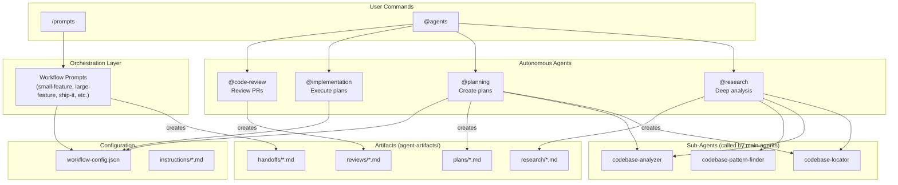
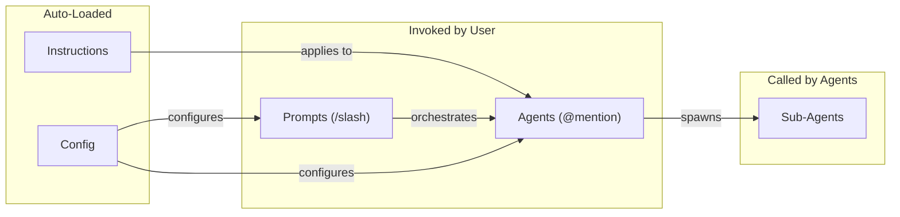
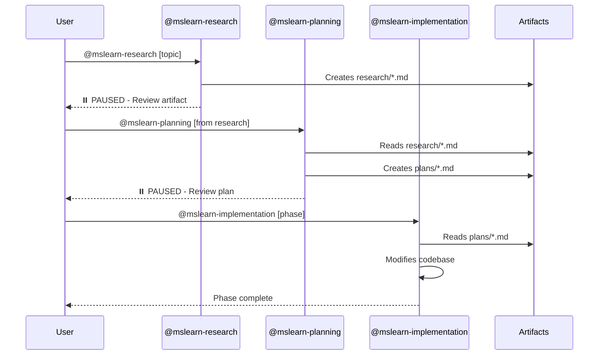

# Copilot Workflow Automation

GitHub Copilot workflow automation for Microsoft Learn platform development.

## Quick Start

```bash
# Research a feature
@mslearn-research Analyze the article rating system in docs-ui

# Create implementation plan
@mslearn-planning Create plan from: copilot-config/agent-artifacts/research/{file}.md

# Implement
@mslearn-implementation Execute Phase 1 of plan

# Ship it
/mslearn-ship-it
```

## Multi-Repo Workspace Setup

Agents are discovered from `.github/agents/` relative to your **active file's repo**. Run the setup script once after cloning to make agents available from all sibling repos:

### One-Time Setup

```powershell
# Windows (PowerShell)
.\setup-agents.ps1

# macOS/Linux
./setup-agents.sh
```

This auto-discovers sibling repos and creates junctions/symlinks to copilot-config's agents folder.

### Options

```bash
# Preview changes without applying
./setup-agents.sh --dry-run

# Link specific repos only
./setup-agents.sh docs-ui feature-gap-wt

# Replace existing agents folders
./setup-agents.sh --force
```

### Manual Setup

If you prefer manual setup or need to add repos in different locations:

```powershell
# Windows (PowerShell) - Junction (no admin required)
New-Item -ItemType Junction -Path "{TARGET_REPO}\.github\agents" -Target "c:\repos\mslearn\copilot-config\.github\agents"
```

```bash
# macOS/Linux - Symlink
ln -s /path/to/copilot-config/.github/agents {TARGET_REPO}/.github/agents
```

### Notes

- **Junctions/symlinks are local** - each developer runs setup once
- If target repo has existing agents, use `--force` to replace or manually merge
- Agents have **full access to all repos** in the workspace regardless of discovery location

## System Architecture



## Component Types



| Type | Invocation | Context | Purpose |
| ------ | ------------ | --------- | --------- |
| **Prompts** | `/command` | Shared with chat | User-initiated workflows, orchestration |
| **Agents** | `@agent-name` | Isolated (own context) | Autonomous complex tasks |
| **Sub-Agents** | Called by agents | Isolated | Focused sub-tasks (locate, analyze, find patterns) |
| **Instructions** | Auto-loaded | Shared | Static rules by file pattern |
| **Config** | Referenced | Minimal | Central settings |

## Workflow Selection


## Artifact Flow



## Directory Structure

```text
copilot-config/
├── README.md                    # This file - system overview
├── WORKFLOWS.md                 # Detailed workflow documentation
├── .github/
│   ├── config/
│   │   └── workflow-config.json # Central configuration
│   ├── agents/                  # Autonomous agents
│   │   ├── mslearn-research.agent.md
│   │   ├── mslearn-planning.agent.md
│   │   ├── mslearn-implementation.agent.md
│   │   ├── mslearn-code-review.agent.md
│   │   ├── mslearn-multi-agent-startup.agent.md
│   │   └── (sub-agents: mslearn-codebase-*, mslearn-thoughts-*, mslearn-web-search-*)
│   ├── prompts/                 # User-invoked workflows
│   │   ├── mslearn-small-feature.prompt.md
│   │   ├── mslearn-large-feature.prompt.md
│   │   ├── mslearn-parity-feature.prompt.md
│   │   ├── mslearn-ship-it.prompt.md
│   │   ├── mslearn-review-it.prompt.md
│   │   ├── mslearn-update-plan.prompt.md
│   │   ├── mslearn-create-ado-workitems.prompt.md
│   │   ├── mslearn-assign-swe.prompt.md
│   │   ├── mslearn-pre-commit.prompt.md
│   │   ├── mslearn-create_handoff.prompt.md
│   │   ├── mslearn-create_plan.prompt.md
│   │   ├── mslearn-implement_plan.prompt.md
│   │   ├── mslearn-research_codebase.prompt.md
│   │   └── mslearn-resume_handoff.prompt.md
│   └── instructions/            # Auto-loaded rules
│       └── azure-devops-workitems.instructions.md
└── agent-artifacts/             # Agent outputs (gitignored)
    ├── research/                # Research documents
    ├── plans/                   # Implementation plans
    ├── handoffs/                # Session handoffs
    └── reviews/                 # Code review documents
```

## Key Concepts

### Pause Points

Research and planning agents **pause after creating artifacts** to allow user review:

```text
✅ Research complete!
⏸️ PAUSED FOR REVIEW

When ready:
  @mslearn-planning Create plan from: {artifact path}
```

### Mermaid Diagrams

All artifacts include Mermaid diagrams for context efficiency:

- Research: Architecture + data flow diagrams
- Plans: Architecture overview + phase dependencies
- Handoffs: Component relationships + current flow

Diagrams help agents understand systems **without re-reading files**.

### Configuration

Central config at `.github/config/workflow-config.json`:

- User settings (alias, email)
- Azure DevOps settings
- Repository-specific commands (build, test, pre-commit)
- Preview URL patterns

## Commands Reference

### Workflows

| Command | Description |
| --------- | ------------- |
| `/mslearn-small-feature` | Quick feature implementation |
| `/mslearn-large-feature` | Complex multi-repo feature |
| `/mslearn-parity-feature` | Port feature between repos |
| `/mslearn-ship-it` | Commit, push, create PR |
| `/mslearn-review-it` | Review PR branch |
| `/mslearn-update-plan` | Sync plan with codebase status |

### Agents

| Agent | Description |
| ------- | ------------- |
| `@mslearn-research` | Deep codebase analysis |
| `@mslearn-planning` | Create implementation plans |
| `@mslearn-implementation` | Execute plan phases |
| `@mslearn-code-review` | Review code changes |
| `@mslearn-multi-agent-startup` | Setup parallel worktrees |

### Skills

| Command | Description |
| --------- | ------------- |
| `/mslearn-create-ado-workitems` | Create ADO items from plan |
| `/mslearn-assign-swe` | Assign GitHub SWE to work item |
| `/mslearn-pre-commit` | Run quality gate checks |

### Session Management

| Command | Description |
| --------- | ------------- |
| `/mslearn-create_handoff` | Save session for later |
| `/mslearn-resume_handoff` | Resume from handoff |

## Documentation

- **[WORKFLOWS.md](WORKFLOWS.md)** - Detailed workflow usage with examples
- **[workflow-config.json](.github/config/workflow-config.json)** - Configuration reference
