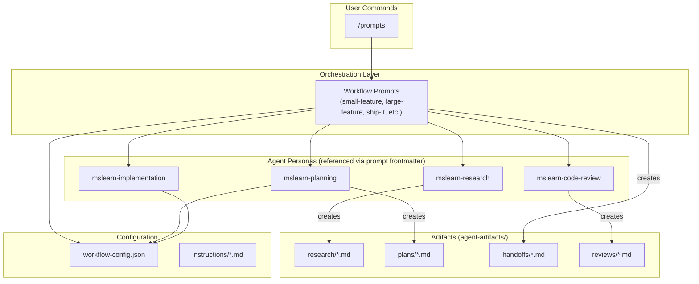
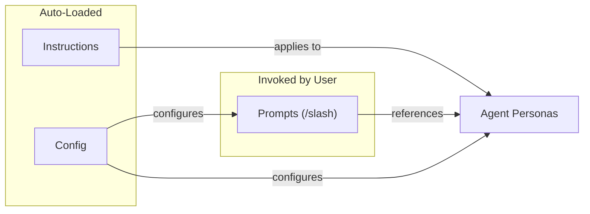
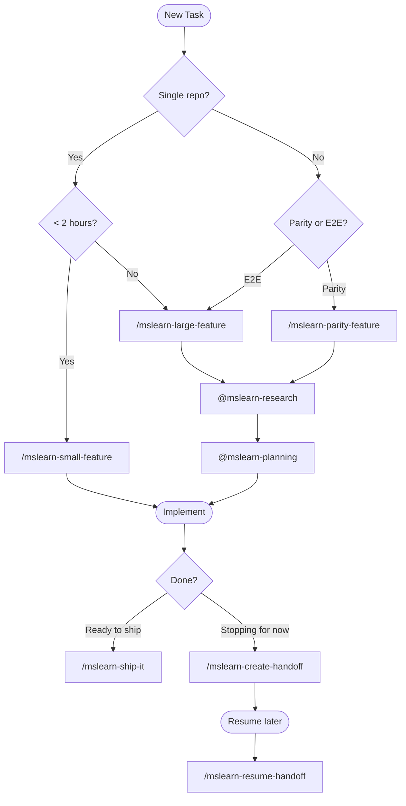
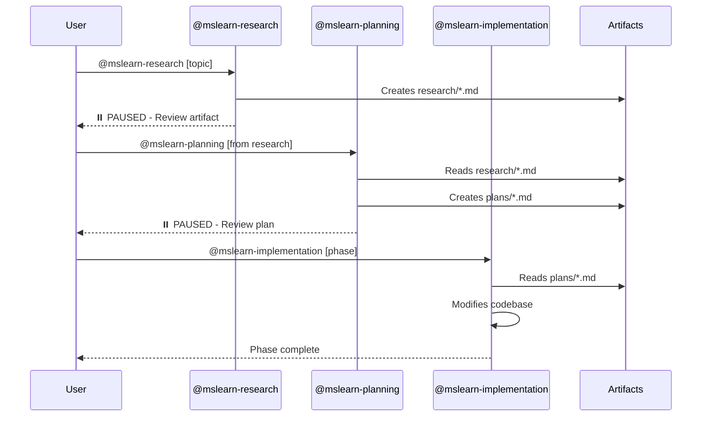

# Copilot Workflow Automation

GitHub Copilot workflow automation for Microsoft Learn platform development.

## Quick Start

```bash
# Research a feature
@mslearn-research Analyze the article rating system in docs-ui

# Create implementation plan
@mslearn-planning Create plan from: copilot-config/agent-artifacts/research/{file}.md

# Implement
@mslearn-implementation Execute Phase 1 of plan

# Ship it
/mslearn-ship-it
```

## Multi-Repo Workspace Setup

Agents are discovered from `.github/agents/` relative to your **active file's repo**. Run the setup script once after cloning to make agents available from all sibling repos:

### One-Time Setup

```powershell
# Windows (PowerShell)
.\setup-agents.ps1

# macOS/Linux
./setup-agents.sh
```

This auto-discovers sibling repos and creates junctions/symlinks to copilot-config's agents folder.

### Options

```bash
# Preview changes without applying
./setup-agents.sh --dry-run

# Link specific repos only
./setup-agents.sh docs-ui feature-gap-wt

# Replace existing agents folders
./setup-agents.sh --force
```

### Manual Setup

If you prefer manual setup or need to add repos in different locations:

```powershell
# Windows (PowerShell) - Junction (no admin required)
New-Item -ItemType Junction -Path "{TARGET_REPO}\.github\agents" -Target "c:\repos\mslearn\copilot-config\.github\agents"
```

```bash
# macOS/Linux - Symlink
ln -s /path/to/copilot-config/.github/agents {TARGET_REPO}/.github/agents
```

### Notes

- **Junctions/symlinks are local** - each developer runs setup once
- If target repo has existing agents, use `--force` to replace or manually merge
- Agents have **full access to all repos** in the workspace regardless of discovery location

## Environment Configuration

The workflow configuration uses environment variables to avoid storing personal information in Git. Set up your environment:

### Initial Setup

1. Copy the environment template:
   ```bash
   cp .env.example .env
   ```

2. Edit `.env` with your personal information:
   ```bash
   # User Information  
   USER_ALIAS=your-alias
   USER_EMAIL=your-email@microsoft.com
   ADO_ASSIGNEE=your-email@microsoft.com
   ADO_AREA_PATH=Engineering\\POD\\YourTeam
   ```

3. The `.env` file is already included in `.gitignore` and will not be committed.

### Environment Variables

| Variable | Description | Example |
|----------|-------------|---------|
| `USER_ALIAS` | Your Microsoft alias | `jumunn` |
| `USER_EMAIL` | Your Microsoft email | `jumunn@microsoft.com` |
| `ADO_ASSIGNEE` | Default assignee for ADO items | `jumunn@microsoft.com` |
| `ADO_AREA_PATH` | Your team's area path | `Engineering\POD\YourTeam` |
| `ADO_ORGANIZATION` | Azure DevOps org URL | `https://dev.azure.com/ceapex` |
| `ADO_PROJECT` | Azure DevOps project name | `Engineering` |
| `ADO_SWE_ASSIGNEE` | SWE agent identity (GUID) | *(see .env.example)* |

The workflow configuration in `.github/config/workflow-config.json` uses `${VAR_NAME}` placeholders that resolve from your `.env` file.

## System Architecture



## Component Types



| Type | Invocation | Context | Purpose |
| ------ | ------------ | --------- | --------- |
| **Prompts** | `/command` | On invoke · High | User-initiated multi-step workflows |
| **Skills** | SKILL.md packages | Metadata auto, body on-demand · Low–Medium | Self-contained single-purpose actions |
| **Hooks** | Automatic | Auto on Copilot action · Low | Copilot action instructions (commit, review, test) |
| **Agent Personas** | Prompt `agent:` frontmatter | Loaded with prompt execution · Medium | Shared tool/instruction configs for prompt workflows |
| **Instructions** | Auto-loaded | Auto on file match · Medium | Static rules by file pattern |
| **Config** | Referenced | On-demand · Low | Central settings |

> **Prompts vs Skills**: Prompts use `.prompt.md` files with frontmatter fields like `description`, `agent`, and `model` for multi-step interactive workflows. Skills use the `SKILL.md` format in `.github/skills/{name}/` directories — self-contained packages with `name`/`description` frontmatter and optional `references/` for templates. Hooks are VS Code Copilot settings in `.vscode/settings.json` that apply automatically.

## Workflow Selection



## Artifact Flow



## Directory Structure

```text
copilot-config/
├── README.md                    # This file - system overview
├── WORKFLOWS.md                 # Detailed workflow documentation
├── .github/
│   ├── config/
│   │   └── workflow-config.json # Central configuration
│   ├── agents/                  # Autonomous agents (loaded by vscode-extension)
│   ├── prompts/                 # User-invoked workflows
│   │   ├── mslearn-small-feature.prompt.md
│   │   ├── mslearn-large-feature.prompt.md
│   │   ├── mslearn-parity-feature.prompt.md
│   │   ├── mslearn-create-plan.prompt.md
│   │   ├── mslearn-implement-plan.prompt.md
│   │   ├── mslearn-research-codebase.prompt.md
│   │   ├── mslearn-ship-it.prompt.md
│   │   ├── mslearn-review-it.prompt.md
│   │   ├── mslearn-update-plan.prompt.md
│   │   ├── mslearn-resume-handoff.prompt.md
│   │   ├── mslearn-create-handoff.prompt.md
│   │   ├── mslearn-create-ado-workitems.prompt.md
│   │   ├── mslearn-assign-swe.prompt.md
│   │   ├── mslearn-explain-pr.prompt.md
│   │   ├── mslearn-pre-commit.prompt.md
│   │   ├── mslearn-prune-worktree.prompt.md
│   │   └── mslearn-create-worktree.prompt.md
│   ├── skills/                  # Self-contained single-purpose actions
│   │   ├── create-ado-workitems/   # SKILL.md + references/templates.md
│   │   ├── assign-swe/            # SKILL.md
│   │   ├── create-handoff/        # SKILL.md + references/template.md
│   │   ├── create-worktree/       # SKILL.md
│   │   ├── explain-pr/            # SKILL.md + references/template.md
│   │   ├── pre-commit/            # SKILL.md
│   │   └── prune-worktree/        # SKILL.md
│   └── instructions/            # Auto-loaded rules
│       └── azure-devops-workitems.instructions.md
├── .vscode/
│   └── settings.json            # Copilot hooks (commit, review, test)
├── vscode-extension/            # MSLearn Copilot Agents extension
└── agent-artifacts/             # Agent outputs (gitignored)
    ├── research/                # Research documents
    ├── plans/                   # Implementation plans
    ├── handoffs/                # Session handoffs
    └── reviews/                 # Code review documents
```

## Key Concepts

### Pause Points

Research and planning agents **pause after creating artifacts** to allow user review:

```text
✅ Research complete!
⏸️ PAUSED FOR REVIEW

When ready:
  @mslearn-planning Create plan from: {artifact path}
```

### Mermaid Diagrams

All artifacts include Mermaid diagrams for context efficiency:

- Research: Architecture + data flow diagrams
- Plans: Architecture overview + phase dependencies
- Handoffs: Component relationships + current flow

Diagrams help agents understand systems **without re-reading files**.

### Configuration

Two-layer config: `.env` for personal settings, `workflow-config.json` for shared structure.

- **`.env`**: alias, email, ADO assignee, area path, org, project (see [Environment Configuration](#environment-configuration))
- **`workflow-config.json`**: `${ENV_VAR}` placeholders, repo commands, preview URLs, artifact patterns
- **Setup**: `cp .env.example .env` then edit with your values

## Commands Reference

### Workflows (multi-step, interactive)

| Command | Description |
| --------- | ------------- |
| `/mslearn-small-feature` | Quick feature implementation (< 2 hours, single repo) |
| `/mslearn-large-feature` | Complex multi-repo feature with research and planning |
| `/mslearn-parity-feature` | Port feature between repos |
| `/mslearn-create-plan` | Create detailed implementation plans |
| `/mslearn-implement-plan` | Execute plan phases with verification |
| `/mslearn-research-codebase` | Document codebase without evaluation |
| `/mslearn-ship-it` | Commit, push, create PR |
| `/mslearn-review-it` | Review PR branch |
| `/mslearn-update-plan` | Sync plan with codebase status |
| `/mslearn-resume-handoff` | Resume from handoff document |
| `/mslearn-create-handoff` | Create a session handoff document |
| `/mslearn-create-ado-workitems` | Create ADO work items from a plan |
| `/mslearn-assign-swe` | Assign GitHub SWE to a work item |
| `/mslearn-explain-pr` | Generate PR explanation documentation |
| `/mslearn-pre-commit` | Run repository quality checks |
| `/mslearn-prune-worktree` | Remove worktrees and clean up resources |
| `/mslearn-create-worktree` | Create worktree with auth, deps, and agent symlinks |

### Skills (self-contained SKILL.md packages in `.github/skills/`)

| Skill | Location | Description |
| ----- | -------- | ----------- |
| `create-ado-workitems` | `.github/skills/create-ado-workitems/` | Create ADO items from plan |
| `assign-swe` | `.github/skills/assign-swe/` | Assign GitHub SWE to work item |
| `create-handoff` | `.github/skills/create-handoff/` | Save session context for later |
| `create-worktree` | `.github/skills/create-worktree/` | Create worktree with auth and npm install |
| `explain-pr` | `.github/skills/explain-pr/` | Generate PR explanation document |
| `pre-commit` | `.github/skills/pre-commit/` | Run quality gate checks |
| `prune-worktree` | `.github/skills/prune-worktree/` | Remove worktrees and workspace files |

### Hooks (automatic, configured in `.vscode/settings.json`)

| Hook | Trigger | What It Does |
| ---- | ------- | ------------ |
| Commit message generation | Copilot generates commit message | Enforces conventional commits format |
| Code review instructions | Copilot reviews code | Applies Learn platform standards |
| Test generation instructions | Copilot generates tests | Applies Jest/TypeScript conventions |

### Agents

| Agent Persona | Description |
| ------- | ------------- |
| `mslearn-research` | Deep codebase research and documentation |
| `mslearn-planning` | Create implementation plans |
| `mslearn-implementation` | Execute plan phases |
| `mslearn-code-review` | Review code changes |

## Documentation

- **[WORKFLOWS.md](WORKFLOWS.md)** - Detailed workflow usage with examples
- **[workflow-config.json](.github/config/workflow-config.json)** - Configuration reference
