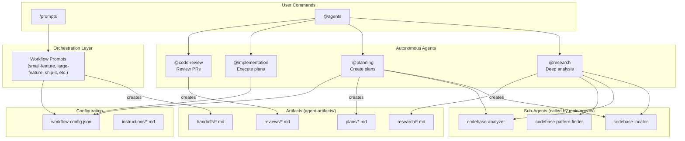
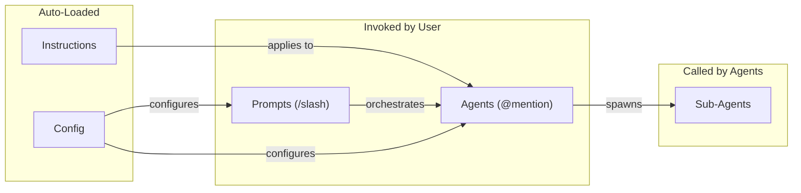
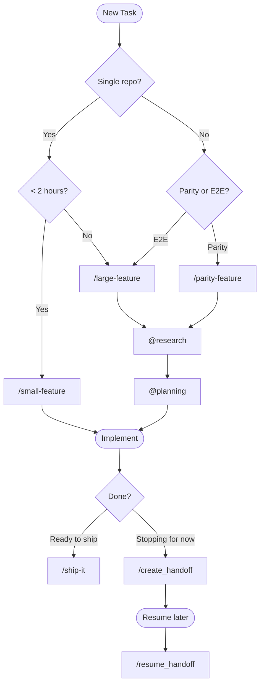
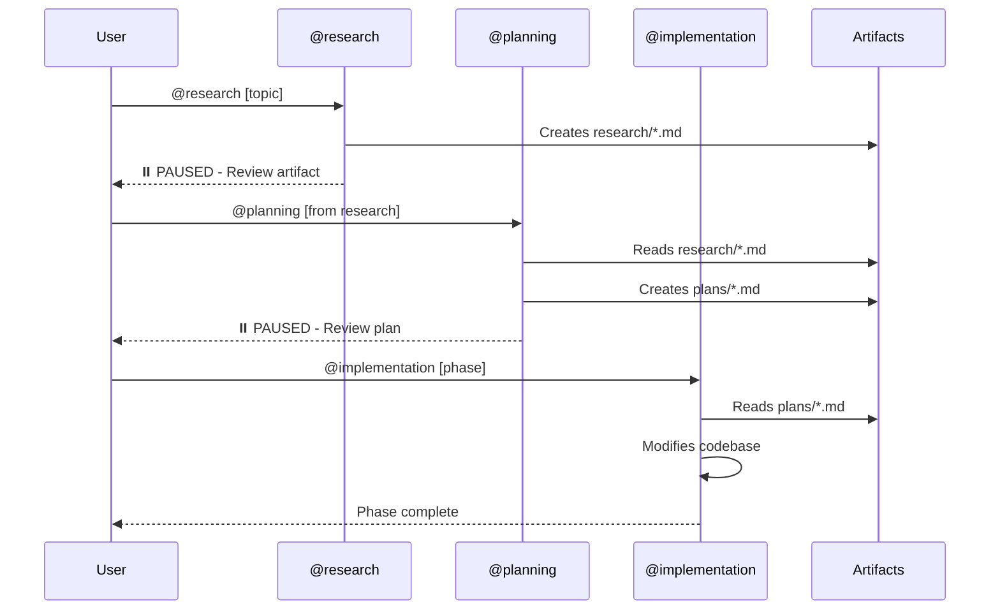

# Copilot Workflow Automation

GitHub Copilot workflow automation for Microsoft Learn platform development.

## Quick Start

```
# Research a feature
@research Analyze the article rating system in docs-ui

# Create implementation plan
@planning Create plan from: copilot-config/agent-artifacts/research/{file}.md

# Implement
@implementation Execute Phase 1 of plan

# Ship it
/ship-it
```

## System Architecture



## Component Types



| Type | Invocation | Context | Purpose |
|------|------------|---------|---------|
| **Prompts** | `/command` | Shared with chat | User-initiated workflows, orchestration |
| **Agents** | `@agent-name` | Isolated (own context) | Autonomous complex tasks |
| **Sub-Agents** | Called by agents | Isolated | Focused sub-tasks (locate, analyze, find patterns) |
| **Instructions** | Auto-loaded | Shared | Static rules by file pattern |
| **Config** | Referenced | Minimal | Central settings |

## Workflow Selection



## Artifact Flow



## Directory Structure

```
copilot-config/
├── README.md                    # This file - system overview
├── WORKFLOWS.md                 # Detailed workflow documentation
├── .github/
│   ├── config/
│   │   └── workflow-config.json # Central configuration
│   ├── agents/                  # Autonomous agents
│   │   ├── research.agent.md
│   │   ├── planning.agent.md
│   │   ├── implementation.agent.md
│   │   ├── code-review.agent.md
│   │   ├── multi-agent-startup.agent.md
│   │   └── (sub-agents: codebase-*, thoughts-*, web-search-*)
│   ├── prompts/                 # User-invoked workflows
│   │   ├── small-feature.prompt.md
│   │   ├── large-feature.prompt.md
│   │   ├── parity-feature.prompt.md
│   │   ├── ship-it.prompt.md
│   │   ├── review-it.prompt.md
│   │   ├── update-plan.prompt.md
│   │   ├── create-ado-workitems.prompt.md
│   │   ├── assign-swe.prompt.md
│   │   ├── pre-commit.prompt.md
│   │   ├── create_handoff.prompt.md
│   │   ├── create_plan.prompt.md
│   │   ├── implement_plan.prompt.md
│   │   ├── research_codebase.prompt.md
│   │   └── resume_handoff.prompt.md
│   └── instructions/            # Auto-loaded rules
│       └── azure-devops-workitems.instructions.md
└── agent-artifacts/             # Agent outputs (gitignored)
    ├── research/                # Research documents
    ├── plans/                   # Implementation plans
    ├── handoffs/                # Session handoffs
    └── reviews/                 # Code review documents
```

## Key Concepts

### Pause Points
Research and planning agents **pause after creating artifacts** to allow user review:
```
✅ Research complete!
⏸️ PAUSED FOR REVIEW

When ready:
  @planning Create plan from: {artifact path}
```

### Mermaid Diagrams
All artifacts include Mermaid diagrams for context efficiency:
- Research: Architecture + data flow diagrams
- Plans: Architecture overview + phase dependencies
- Handoffs: Component relationships + current flow

Diagrams help agents understand systems **without re-reading files**.

### Configuration
Central config at `.github/config/workflow-config.json`:
- User settings (alias, email)
- Azure DevOps settings
- Repository-specific commands (build, test, pre-commit)
- Preview URL patterns

## Commands Reference

### Workflows
| Command | Description |
|---------|-------------|
| `/small-feature` | Quick feature implementation |
| `/large-feature` | Complex multi-repo feature |
| `/parity-feature` | Port feature between repos |
| `/ship-it` | Commit, push, create PR |
| `/review-it` | Review PR branch |
| `/update-plan` | Sync plan with codebase status |

### Agents
| Agent | Description |
|-------|-------------|
| `@research` | Deep codebase analysis |
| `@planning` | Create implementation plans |
| `@implementation` | Execute plan phases |
| `@code-review` | Review code changes |
| `@multi-agent-startup` | Setup parallel worktrees |

### Skills
| Command | Description |
|---------|-------------|
| `/create-ado-workitems` | Create ADO items from plan |
| `/assign-swe` | Assign GitHub SWE to work item |
| `/pre-commit` | Run quality gate checks |

### Session Management
| Command | Description |
|---------|-------------|
| `/create_handoff` | Save session for later |
| `/resume_handoff` | Resume from handoff |

## Documentation

- **[WORKFLOWS.md](WORKFLOWS.md)** - Detailed workflow usage with examples
- **[workflow-config.json](.github/config/workflow-config.json)** - Configuration reference
