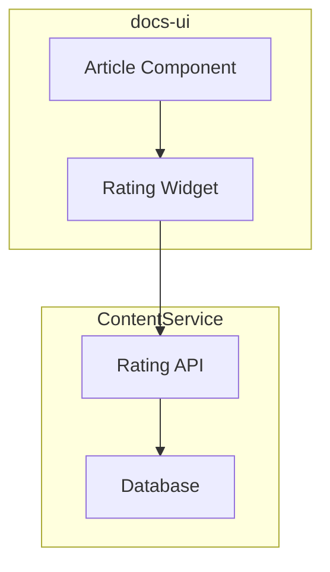

# Copilot Workflow System

This document describes the GitHub Copilot workflow automation system for the Microsoft Learn platform. The system is designed to optimize context window usage while providing powerful automation capabilities.

## Architecture Overview

### Component Types

| Type | Purpose | Context Impact | When to Use |
|------|---------|----------------|-------------|
| **Instructions** | Static rules auto-loaded by file patterns | Low (loaded automatically) | Coding standards, patterns that always apply |
| **Agents** | Autonomous tasks with their own context | Isolated (separate context) | Complex research, analysis, multi-step autonomous work |
| **Prompts** | User-initiated multi-step workflow orchestration | Shared (uses main context) | Interactive workflows, orchestrating agents |
| **Skills** | Self-contained single-purpose actions (`SKILL.md` packages) | On-demand | Specific actions: ADO items, handoffs, SWE assignment |
| **Hooks** | Automated Copilot instructions for specific actions | Minimal (auto-applied) | Commit messages, code review, test generation |

> **Note**: Skills use the `SKILL.md` format in `.github/skills/{name}/` directories with `name` and `description` frontmatter. Each skill is a self-contained package that may include `references/` for templates and domain knowledge. Hooks are configured as VS Code Copilot settings in `.vscode/settings.json`.

### Directory Structure

```
copilot-config/
├── .github/
│   ├── agents/                          # Autonomous agents (loaded by vscode-extension)
│   │   └── (agent .md files loaded by MSLearn Copilot Agents extension)
│   ├── config/
│   │   └── workflow-config.json         # Central configuration
│   ├── instructions/
│   │   └── azure-devops-workitems.instructions.md
│   ├── prompts/                         # User-initiated workflows
│   │   ├── mslearn-small-feature.prompt.md      # Quick feature implementation
│   │   ├── mslearn-large-feature.prompt.md      # Complex multi-repo features
│   │   ├── mslearn-parity-feature.prompt.md     # Port features between repos
│   │   ├── mslearn-ship-it.prompt.md            # Commit, push, create PR
│   │   ├── mslearn-review-it.prompt.md          # Review PR branches
│   │   ├── mslearn-update-plan.prompt.md        # Sync plan with codebase
│   │   ├── mslearn-create_plan.prompt.md        # Create implementation plans
│   │   ├── mslearn-implement_plan.prompt.md     # Implement from plans
│   │   ├── mslearn-research_codebase.prompt.md  # Research codebase
│   │   └── mslearn-resume_handoff.prompt.md     # Resume from handoffs
│   └── skills/                          # Self-contained single-purpose actions (SKILL.md)
│       ├── create-ado-workitems/
│       │   ├── SKILL.md                         # Create ADO items from plan
│       │   └── references/templates.md          # HTML templates for work items
│       ├── assign-swe/
│       │   └── SKILL.md                         # Assign GitHub SWE to work item
│       ├── create-handoff/
│       │   ├── SKILL.md                         # Create session handoff document
│       │   └── references/template.md           # Handoff document template
│       ├── explain-pr/
│       │   ├── SKILL.md                         # Generate PR explanation document
│       │   └── references/template.md           # PR explanation template
│       └── pre-commit/
│           └── SKILL.md                         # Run quality gate checks
├── .vscode/
│   └── settings.json                   # Copilot hooks (commit, review, test)
├── vscode-extension/                   # MSLearn Copilot Agents extension
└── agent-artifacts/                     # Agent output (not committed)
    ├── research/                        # Research documents
    ├── plans/                           # Implementation plans
    ├── handoffs/                        # Session handoffs
    └── reviews/                         # Code review documents
```

## Configuration

All workflow configuration is centralized in `.github/config/workflow-config.json`.

### Key Configuration Sections

```json
{
  "user": {
    "alias": "your-alias",
    "email": "your-email@microsoft.com"
  },
  "azureDevOps": {
    "organization": "https://dev.azure.com/ceapex",
    "project": "Engineering",
    "areaPath": "Engineering\\POD\\Your-Pod",
    "sweAssignee": "GitHub-Copilot-SWE-ID"
  },
  "repositories": {
    "docs-ui": {
      "defaultBranch": "develop",
      "preCommitCommand": "npx wireit betterer precommit --cache",
      "previewUrlPattern": "https://ppe.preview.learn.microsoft-int.com/?pr={PrNumber}"
    }
  }
}
```

**Note**: Repos are detected from your workspace. If you reference a repo not in your workspace, you'll be prompted to add it.

---

## Workflows

### 1. Small Feature Workflow

**Use when**: Quick, well-scoped features in a single repo (< 2 hours)

```
/small-feature

"Add a loading spinner to the search results component"
```

**Flow**:
1. Quick context scan
2. Find patterns to follow
3. Implement changes
4. Run quality checks
5. Summary with changes

**Example**:
```
User: /small-feature Add error handling to the API client

Agent:
→ Scans packages/scripts/src/api/ for patterns
→ Finds existing error handling in similar-client.ts
→ Implements matching pattern
→ Runs: npx wireit betterer precommit --cache
→ Reports: "✅ Added error handling to api-client.ts:45-60"
```

---

### 2. Large End-to-End Feature Workflow

**Use when**: Complex features spanning multiple repos (> 1 day)

```
/large-feature

"Implement a new content rating system that stores ratings in ContentService 
and displays them in docs-ui"
```

**Flow**:
1. **Research Phase**: @research agent analyzes both repos
2. **Planning Phase**: @planning agent creates phased implementation
3. **Work Item Creation**: Option to create ADO items
4. **Implementation**: Phase by phase with quality gates
5. **Integration Testing**: Cross-repo verification

**Example**:
```
User: /large-feature Implement user progress tracking across modules

Phase 1: Research
→ @research: Analyze docs-ui for UI patterns
→ @research: Analyze Docs.ContentService for API patterns
→ Output: agent-artifacts/research/2026-02-04-progress-tracking.md
→ ⏸️ PAUSED - User reviews research artifact

User: @planning Create implementation plan from:
       copilot-config/agent-artifacts/research/2026-02-04-progress-tracking.md

Phase 2: Planning
→ @planning: Create phased plan from research
→ Output: agent-artifacts/plans/2026-02-04-progress-tracking-plan.md
→ Identifies: 3 phases, 2 suitable for SWE
→ ⏸️ PAUSED - User reviews plan artifact

User: /create-ado-workitems
      Plan: copilot-config/agent-artifacts/plans/2026-02-04-progress-tracking-plan.md
      Parent Feature ID: 12345

Phase 3: ADO Work Items
→ Creates: 3 User Stories, 8 Tasks under Feature #12345

User: @implementation
      Plan: copilot-config/agent-artifacts/plans/2026-02-04-progress-tracking-plan.md
      Execute: Phase 1

Phase 4: Implementation
→ @implementation: Execute Phase 1
→ Human or SWE: Execute Phase 2
→ @implementation: Execute Phase 3

Phase 5: Ship
→ /ship-it (for each repo)
```

---

### 3. Parity Feature Workflow

**Use when**: Porting a feature from one repo to another

```
/parity-feature

"Port the article navigation component from docs-ui to Learn.SharedComponents"
```

**Flow**:
1. Check if both repos are in workspace (offer to add if not)
2. Analyze source implementation
3. Analyze target repo patterns
4. Create mapping plan
5. Implement with adaptations

**Example**:
```
User: /parity-feature Port the collapsible TOC from docs-ui to SharedComponents

→ Check workspace: Both repos present ✓

→ @research: Document docs-ui TOC implementation
  - Component: packages/scripts/src/toc/
  - Styling: LESS with variables
  - State: Internal component state
  → ⏸️ PAUSED - User reviews source research

User: @research Analyze SharedComponents patterns for comparison
  
→ @research: Analyze SharedComponents patterns
  - Styling: Griffel CSS-in-JS with tokens
  - State: Props + context pattern
  → ⏸️ PAUSED - User reviews target research

User: @planning Create parity plan from both research artifacts
  
→ @planning: Create parity plan
  - Convert LESS → Griffel makeStyles
  - Convert class component → function component with hooks
  - Map variables → Fluent UI tokens
  → ⏸️ PAUSED - User reviews plan

User: @implementation Execute parity plan
```

---

### 4. Update Plan Workflow

**Use when**: Syncing a plan with actual implementation progress

```
/update-plan
/update-plan copilot-config/agent-artifacts/plans/2026-02-04-rating-plan.md
```

**Flow**:
1. Read plan
2. Check codebase for implemented changes
3. Update plan with progress markers
4. Report current status

**Example**:
```
User: /update-plan

Plan: 2026-02-04-rating-plan.md

Progress Analysis:
[████████░░░░░░░░░░░░] 40% Complete

✅ Phase 1: Complete (verified in codebase)
🔄 Phase 2: Partial (60% - missing error handling)
⬜ Phase 3-5: Not started

Next recommended:
→ Complete Phase 2: Add error handling to rating-api.ts

Resume implementation:
  @implementation
  Plan: copilot-config/agent-artifacts/plans/2026-02-04-rating-plan.md
  Execute: Phase 2
```

---

### 5. Ship It Workflow

**Use when**: Ready to commit, push, and create a PR

```
/ship-it
```

**Flow**:
1. Pre-flight checks (uncommitted changes, current branch)
2. Run quality gates (betterer/build/lint)
3. Stage and commit
4. Push branch
5. Create PR with template
6. Output preview URL

**Example**:
```
User: /ship-it

Pre-flight:
- Branch: jumunn/add-rating-component
- Repo: docs-ui
- Changes: 5 files

Quality Gate:
→ Running: npx wireit betterer precommit --cache
→ ✅ All checks passed

Git Operations:
→ git add -A
→ git commit -m "feat: add rating component for articles"
→ git push -u origin jumunn/add-rating-component

PR Created:
→ PR #4567: https://dev.azure.com/ceapex/Engineering/_git/docs-ui/pullrequest/4567
→ Preview: https://ppe.preview.learn.microsoft-int.com/?pr=4567
```

---

### 6. Review It Workflow

**Use when**: Need to review a PR branch

```
/review-it
/review-it PR-4567
/review-it --focus accessibility
```

**Flow**:
1. Get changed files
2. Analyze against patterns
3. Generate structured review
4. Present findings

**Example**:
```
User: /review-it

Reviewing: jumunn/add-rating-component

→ @code-review analyzing 5 changed files...

📊 Summary:
- Critical issues: 0
- Major issues: 1
- Minor issues: 3
- Nits: 2

🟠 Major (should fix):
- packages/scripts/src/rating/index.ts:45
  Missing error boundary for async operation

🟡 Minor:
- Consider using tokens instead of hardcoded color

✅ What's done well:
- Good use of existing component patterns
- Proper TypeScript types

Review saved: agent-artifacts/reviews/2026-02-04-4567-rating-review.md
```

---

### 7. Multi-Agent Parallel Work

**Use when**: Working on multiple tasks simultaneously

```
/multi-agent-startup

Tasks:
1. Add loading states to search
2. Implement filter component  
3. Add pagination to results
```

**Flow**:
1. Analyze tasks for conflicts
2. Create git worktrees
3. Provide startup commands
4. Manage parallel development

**Example**:
```
User: /multi-agent-startup [3 tasks listed above]

Conflict Analysis:
✅ Task 1 & Task 2: No overlap (different components)
⚠️ Task 2 & Task 3: Minor overlap (both touch results container)
   → Grouped in same worktree

Worktrees Created:
1. docs-ui-wt-search-loading
   Branch: jumunn/search-loading
   Tasks: Task 1
   Start: cd ../docs-ui-wt-search-loading && code .

2. docs-ui-wt-filter-pagination  
   Branch: jumunn/filter-pagination
   Tasks: Task 2, Task 3
   Start: cd ../docs-ui-wt-filter-pagination && code .

Merge Order:
1. search-loading (independent)
2. filter-pagination (independent)
```

---

## Skills

Skills are self-contained, single-purpose action packages using the `SKILL.md` format. Each skill lives in `.github/skills/{name}/` with a `SKILL.md` file (containing `name` and `description` frontmatter) and optional `references/` for templates and domain knowledge.

### Create ADO Work Items

Skill: `.github/skills/create-ado-workitems/`

```
Create ADO work items from plan:
  Plan: copilot-config/agent-artifacts/plans/2026-02-04-rating-plan.md
  Parent Feature: 12345
```

Creates hierarchical work items from implementation plans:
- User Story per phase
- Tasks per file change
- SWE tags where applicable

### Assign GitHub SWE

Skill: `.github/skills/assign-swe/`

```
Assign SWE to work item 67890
Assign SWE to 67890 with instructions: "Follow Phase 2 of the rating plan"
```

Assigns GitHub Copilot Workspace Agent to work items suitable for automated implementation.

### Create Handoff

Skill: `.github/skills/create-handoff/`

When stopping work to resume later:

```
Create a handoff for this session
```

Creates structured handoff document with task status, recent changes, learnings, artifacts, and next steps. Saves to `agent-artifacts/handoffs/`.

### Explain PR

Skill: `.github/skills/explain-pr/`

Generate comprehensive documentation of what was done in a PR branch:

```
Explain what was done in this PR branch
```

Creates a research-style document explaining all changes, architectural decisions, and pattern references. Saves to `agent-artifacts/reviews/`.

### Pre-Commit Check

Skill: `.github/skills/pre-commit/`

Run repository-specific quality gates manually:

```
Run pre-commit quality checks
```

Runs the matching command from `workflow-config.json` for the current repo:
| Repository | Command |
|------------|---------|
| docs-ui | `npx wireit betterer precommit --cache` |
| Learn.SharedComponents | `npm run clean && npm run components:build && npm run app:build` |
| Docs.ContentService | `dotnet build` |

> `/mslearn-ship-it` runs this automatically before committing.

---

## Copilot Hooks

Hooks are automated Copilot instructions that apply to specific actions without manual invocation. They are configured in `.vscode/settings.json`.

### Commit Message Generation

**Setting**: `github.copilot.chat.commitMessageGeneration.instructions`

Automatically applies conventional commits format when Copilot generates commit messages:
- Format: `type(scope): description`
- Types: `feat`, `fix`, `refactor`, `docs`, `test`, `chore`
- ADO work items referenced with `AB#{id}` in footer

### Code Review

**Setting**: `github.copilot.chat.reviewSelection.instructions`

Automatically applies Microsoft Learn platform standards when Copilot reviews code:
- No `any` types in TypeScript
- Fluent UI design tokens over hardcoded values
- SSR compatibility checks
- WCAG accessibility compliance
- Pattern adherence validation

### Test Generation

**Setting**: `github.copilot.chat.testGeneration.instructions`

Automatically applies project test conventions when Copilot generates tests:
- Jest with TypeScript
- Descriptive `should` test names
- Griffel CSS-in-JS mocked for performance
- Both client and SSR rendering paths for React components

---

## Session Management

### Resume Handoff

When resuming work:

```
/mslearn-resume_handoff CAS-123
/mslearn-resume_handoff copilot-config/agent-artifacts/handoffs/CAS-123/2026-02-04_...md
```

Loads context and proposes next actions.

---

## Best Practices

### Context Window Optimization

1. **Use agents for heavy research** - They get their own context window
2. **Use prompts for orchestration** - Coordinate agents efficiently  
3. **Reference artifacts** - Don't repeat information, point to files
4. **Clean handoffs** - Compact context for session transitions
5. **Include Mermaid diagrams** - Convey system structure in fewer tokens than prose

### Mermaid Diagrams

Agents understand Mermaid diagrams efficiently. Diagrams help new sessions understand systems **without re-crawling files**.

**Required in artifacts:**
- Research documents: 2-3 diagrams (architecture, data flow, state)
- Plans: Architecture overview + phase dependencies
- Handoffs: Component relationships + current flow being worked on

**Diagram types and when to use:**

| Type | Use For | Example |
|------|---------|---------|
| `graph TB/LR` | Component relationships, architecture | Services, UI components, dependencies |
| `sequenceDiagram` | Data flow, API calls, user journeys | Request/response, event flows |
| `stateDiagram-v2` | Stateful components, workflows | Loading states, form states |
| `classDiagram` | Data models, interfaces | Entities, DTOs, contracts |
| `flowchart` | Decision logic, processes | Build pipelines, validation flows |

**Example - Architecture diagram:**


**Why this matters:** A diagram like this replaces 20+ lines of prose AND doesn't require the agent to read multiple files to understand the relationship.

### Workflow Selection Guide

| Scenario | Command | Type |
|----------|---------|------|
| Quick bug fix | `/mslearn-small-feature` | Workflow |
| New feature, single repo | `/mslearn-small-feature` or `/mslearn-large-feature` | Workflow |
| Cross-repo feature | `/mslearn-large-feature` | Workflow |
| Copy feature to another repo | `/mslearn-parity-feature` | Workflow |
| Create implementation plan | `/mslearn-create_plan` | Workflow |
| Implement from plan | `/mslearn-implement_plan` | Workflow |
| Research codebase | `/mslearn-research_codebase` | Workflow |
| Sync plan with codebase | `/mslearn-update-plan` | Workflow |
| Review PR branch | `/mslearn-review-it` | Workflow |
| Ready to submit PR | `/mslearn-ship-it` | Workflow |
| Create ADO work items | `create-ado-workitems` skill | Skill |
| Assign SWE to work item | `assign-swe` skill | Skill |
| Document PR changes | `explain-pr` skill | Skill |
| Run quality checks | `pre-commit` skill | Skill |
| Stopping for the day | `create-handoff` skill | Skill |
| Starting new session | `/mslearn-resume_handoff` | Workflow |
| Commit message format | *(automatic)* | Hook |
| Code review standards | *(automatic)* | Hook |
| Test generation conventions | *(automatic)* | Hook |

### Agent Delegation

When to use agents vs doing work directly:

| Task | Approach |
|------|----------|
| Find files | @codebase-locator |
| Understand implementation | @codebase-analyzer |
| Find patterns to follow | @codebase-pattern-finder |
| Deep research | @research |
| Create detailed plan | @planning |
| Implement code | @implementation or direct |
| Review PR | @code-review |

---

## Configuration Reference

See [workflow-config.json](.github/config/workflow-config.json) for:
- User settings
- Azure DevOps configuration  
- Repository-specific settings
- Preview URL patterns
- Build/test commands
